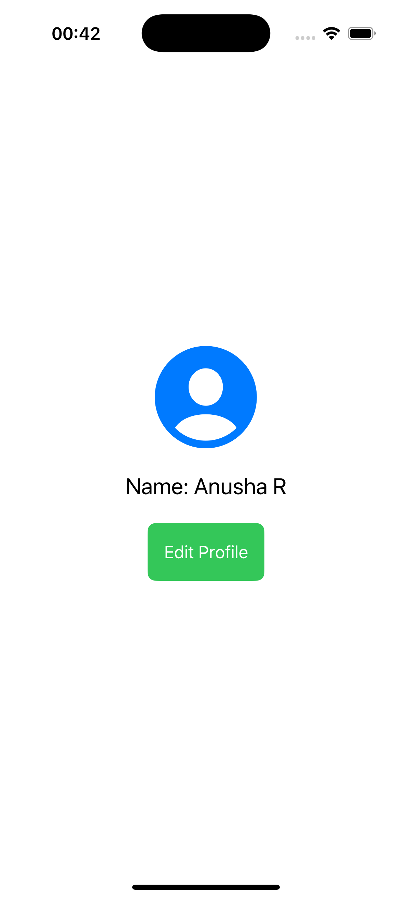

# 📱 Day 1: SwiftUI Profile View App

## 🛠 Environment
- **Xcode 16.4**  
- **Swift 6.1 / 6.1.2**  
- **SwiftUI 5+** (iOS 18.5 SDK)  
- **Simulator**: iPhone 16 Pro (6.3″ Super Retina XDR, A18 Pro chip, 48 MP cameras) :contentReference[oaicite:1]{index=1}

---

## ✅ Objective
Create a simple profile screen using **SwiftUI**, demonstrating:
- `@State` for dynamic UI updates  
- Layout using `VStack`  
- System images with modifiers  
- Basic `Button` interaction  

---

## 🖼 Screenshots
_Add your simulator screenshot below (e.g., `screenshot.png`)._

---

## 📦 Features
- SwiftUI layout using `VStack`  
- State-driven UI updates (`@State`)  
- Button that edits the name  
- System image via SF Symbols  

---

## 🧠 Concepts Covered
| Concept       | Description |
|---------------|-------------|
| `@State`      | Tracks mutable state and re-renders views |
| `VStack`      | Vertically stacks views |
| `Button`      | Tap interaction |
| Modifiers     | Chained methods to style views |
| Swift Structs | Value-type UI definitions |
| Swift 6.1     | Latest language version in Xcode 16.4 :contentReference[oaicite:2]{index=2} |

---

## 🛠 Technologies Used
- **Xcode 16.4** — Swift 6.1, iOS 18.5, live SwiftUI previews :contentReference[oaicite:3]{index=3}  
- **SwiftUI** (iOS 18.5 SDK)  
- **Simulator** – iPhone 15 / iOS 18.5  

---

## 🚀 Next Steps
- Add a `TextField` for entering/editing the name  
- Try responsive layout using `GeometryReader` (see Day 2)  
- Include preview-only debugging (`print()` in Previews — new in iOS 16.4+) :contentReference[oaicite:4]{index=4}  

---

## 💡 Learnings
- How **Xcode 16.4** integrates Swift 6.1 and iOS 18.5 SDK  
- Role of `@State` in UI updates  
- SwiftUI layout fundamentals (`VStack`, modifiers, binding)  
- Enhanced SwiftUI previews in Xcode 16.4 for faster iteration :contentReference[oaicite:5]{index=5}  

---

_Prepared by Anusha — Next up: Day 2's responsive layout and advanced UI components!_
